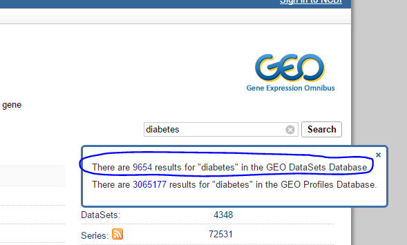
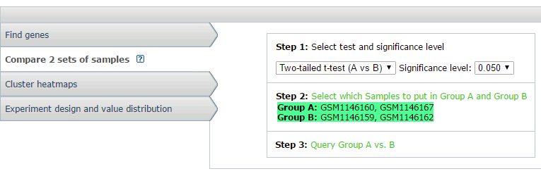

# BioDataSorter

Please fork us to contribute and let us know what could be improved or fixed!

## Summary

This is a project that we are working on for Winthrop University Hospital for genes to study in diabetes and multiple
sclerosis. The program takes data in the form of Excel spreadsheets that have a gene 'Symbol' column and 'Synonyms'
column, like the spreadsheets that can be downloaded from NCBI's Gene Expression Omnibus (GEO), which is a public
functional genomics data repository for array-based and sequence-based data. Sample data for input and output into the
program can be found in the [Sample Data folder](https://github.com/BioDataSorter/BioDataSorter/tree/master/Sample%20Data).

## How to Get NCBI GEO Data
(Soon to be automated from program!)  
1. Search a keyword in [GEO](http://www.ncbi.nlm.nih.gov/geo)  
2. Click on the datasets results  
  
3. Click on a result that interests you  
4. Click on *Compare 2 sets of samples* and choose sample groups to analyze gene fluctuations  
  
5. Follow the link under *Step 3*, which will lead you to the profile data results  
6. Change the *Items per page* to 500  
  
7. Click the *Download profile data* button in the right margin.  
8. Convert the .txt document to a .xlsx document  

## Setup
1. Clone or download the repository to your computer  
2. Make sure you have Python 3 installed on your computer as well as all of the dependencies  
    * Biopython- can be installed from [Biopython on GitHub](https://github.com/biopython/DIST) for
    32-bit versions or [www.lfd.uci.edu](http://www.lfd.uci.edu/~gohlke/pythonlibs/#biopython) for a 64-bit version  

    * Use pip to install the rest of the requirements  
        1. Make sure pip is in your environment variables' PATH variable as C:\Python34\Scripts\pip  
        2. In command prompt, navigate to the BioDataSorter repository and run `python -m pip install -r requirements.txt`
        3. If this doesn't work, install each one separately (Pillow, openpyxl, requests, mygene) using <pre>python -m pip install _requirement_</pre>

## Usage

1. Click new and input data - the file would be the GEO file from the above instructions
2. Right-click and select *More Options*
3. Change the Symbol Column to the input's *Symbol* or *Gene Symbol* column letter
4. Change the Synonyms Column to the input's *Synonyms* or *Gene Title* column letter
5. Select any other options you wish to include in your output
6. Click run in the Form page or from the Run Menu
7. Wait for the program to finish

## Contact Us
### Send us questions, constructive criticism, comments, and suggestions for features!
Email: caitlinchou@gmail.com
